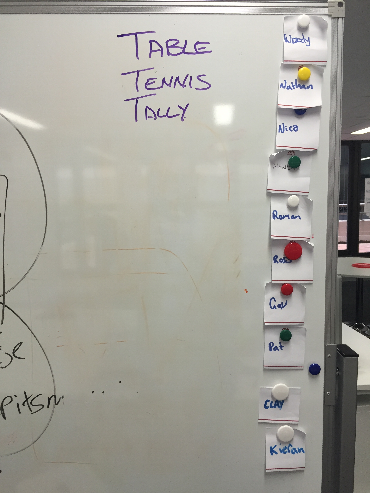
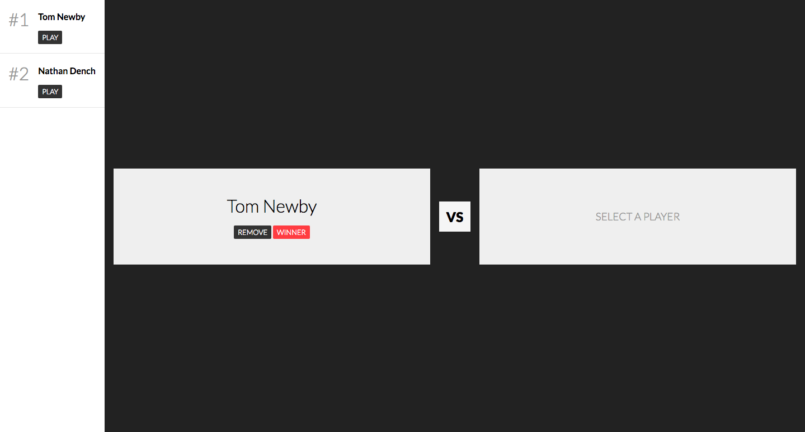
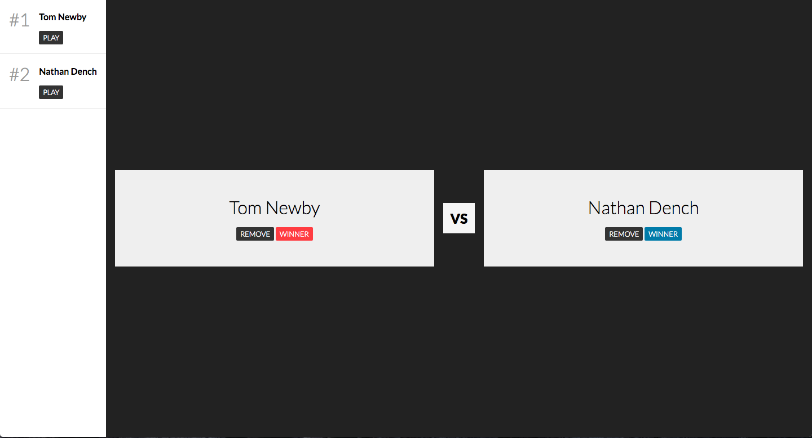

# redeye-frontend-challenge

This is a sample Aurelia application forked off from the [aurelia/skeleton-navigation](https://github.com/aurelia/skeleton-navigation) project. It removes the navigation
components and is a router-less application. Some remenants of the base application are still around (e2e tests, notably), but are largely not important.

The solution we're looking for is a simple digital version of what we keep on the whiteboard in the RedEye office:



## Specifications

We keep track of who's ahead of who on a simple 'leaderboard' on a whiteboard in the RedEye office, to denote who is the
ping ping champion (it's usually Woody). When Player 1 beats Player 2 in a game, Player 1 is able to jump to the spot 
directly above Player 2 on the leaderboard, pushing everyone below them down the leaderboard.

For example, if Player 1 was ranked 8th and Player 2 was ranked 3rd and Player 1 beat Player 2, Player 1 would move to 
3rd place, pushing Player 2 to 4th and further consecutively down the leaderboard.

The application should list the players on the left, sorted by ranking. The user should be able to load up two players
and then decide the winner of the game. By deciding the winner, it should update the leaderboard with the new standings
and then clear the "currently playing" area of the application.

There is no requirement to be able to add/remove players.

Below are mockups that the app should ideally be as close to as possible. The font utilised is Lato. The app will be
tested in Chrome, so feel free to use modern things like flexbox. You're welcome to use a CSS framework, but it probably
won't help much.

## Requirements
Some basic requirements of things that we are looking for:

* taking mockups (see below) and creating HTML/CSS
* using the Aurelia framework to achieve a simple application
* add a LESS compilation step to Gulp, so that during `gulp watch`, modifying the LESS file triggers a rebuild
* demonstrate a basic competency with Karma unit tests (not wanting high code coverage at all)
* **ideally**: persisting with localStorage
* **ideally**: check that `gulp export` is exporting your application fine

If you can't do something, that's OK, we're looking to see what you can do.

## Mockups of desired app




## Hints

Some hints:

* [gulp-less](https://github.com/plus3network/gulp-less)
* [ilikekillnerds](http://ilikekillnerds.com/)
* [durandal blog](http://blog.durandal.io/)
* [gitter chat](https://gitter.im/aurelia/Discuss)
* [aurelia cheatsheet](https://github.com/aurelia/framework/blob/master/doc/article/en-US/cheat-sheet.md)
* you might want to use "value-converters" and "custom components" from the aurelia framework

## Submitting:

You should find a branch with your name which you can fork into your own account and create a pull request back to **your**
branch. If you cannot find a branch with your name, or are having difficult, contact Tom. We _do_ want to see you committing,
so don't worry about having to rebase 100 commits into one pretty commit for us, we're interested in the history.

## Questions:

If you have any questions, just email tom [at] redeye [dot] co.

## Aurelia Skeleton Navigation Documentation:

These are the docs that come with the Skeleton Nav application out of the box.

### Running The App

To run the app, follow these steps.

1. Ensure that [NodeJS](http://nodejs.org/) is installed. This provides the platform on which the build tooling runs.
2. From the project folder, execute the following command:

  ```shell
  npm install
  ```
3. Ensure that [Gulp](http://gulpjs.com/) is installed globally. If you need to install it, use the following command:

  ```shell
  npm install -g gulp
  ```
  > **Note:** Gulp must be installed globally, but a local version will also be installed to ensure a compatible version is used for the project.
4. Ensure that [jspm](http://jspm.io/) is installed globally. If you need to install it, use the following command:

  ```shell
  npm install -g jspm
  ```
  > **Note:** jspm must be installed globally, but a local version will also be installed to ensure a compatible version is used for the project.

  > **Note:** jspm queries GitHub to install semver packages, but GitHub has a rate limit on anonymous API requests. It is advised that you configure jspm with your GitHub credentials in order to avoid problems. You can do this by executing `jspm registry config github` and following the prompts. If you choose to authorize jspm by an access token instead of giving your password (see GitHub `Settings > Personal Access Tokens`), `public_repo` access for the token is required.
5. Install the client-side dependencies with jspm:

  ```shell
  jspm install -y
  ```
  >**Note:** Windows users, if you experience an error of "unknown command unzip" you can solve this problem by doing `npm install -g unzip` and then re-running `jspm install`.
6. To run the app, execute the following command:

  ```shell
  gulp watch
  ```
7. Browse to [http://localhost:9000](http://localhost:9000) to see the app. You can make changes in the code found under `src` and the browser should auto-refresh itself as you save files.

> The Skeleton App uses [BrowserSync](http://www.browsersync.io/) for automated page refreshes on code/markup changes concurrently across multiple browsers. If you prefer to disable the mirroring feature set the [ghostMode option](http://www.browsersync.io/docs/options/#option-ghostMode) to false

### Running The App under Electron

#### Note:
The first five steps below are identical to the first five steps for running this app the "standard' way, using the jspm / systemjs tooling. The difference is in the command to run the app, where the standard `gulp watch` command is replaced by the sequence of two commands:

```shell
gulp build
electron index.js
```

To run the app under [Electron](http://electron.atom.io), follow these steps.

1. Install [Electron](http://electron.atom.io)

  ```shell
  npm install electron-prebuilt -g
```

2. From the project folder, execute the following command:

  ```shell
  npm install
  ```

3. Ensure that [Gulp](http://gulpjs.com/) is installed globally. If you need to install it, use the following command:

  ```shell
  npm install -g gulp
  ```
  > **Note:** Gulp must be installed globally, but a local version will also be installed to ensure a compatible version is used for the project.

4. Ensure that [jspm](http://jspm.io/) is installed globally. If you need to install it, use the following command:

  ```shell
  npm install -g jspm
  ```
  > **Note:** jspm must be installed globally, but a local version will also be installed to ensure a compatible version is used for the project.

  > **Note:** jspm queries GitHub to install semver packages, but GitHub has a rate limit on anonymous API requests. It is advised that you configure jspm with your GitHub credentials in order to avoid problems. You can do this by executing `jspm registry config github` and following the prompts. If you choose to authorize jspm by an access token instead of giving your password (see GitHub `Settings > Personal Access Tokens`), `public_repo` access for the token is required.

5. Install the client-side dependencies with jspm:

  ```shell
  jspm install -y
  ```
  >**Note:** Windows users, if you experience an error of "unknown command unzip" you can solve this problem by doing `npm install -g unzip` and then re-running `jspm install`.

6. To build the app execute the following command (this will give you a dist directory)

 ```shell
    gulp build
 ```

7. To start the app, execute the following command:

  ```shell
  electron index.js
  ```
>**Note:** If typing the command `electron index.js` is too much for you change this line in package.json from `"main": "dist/main.js",` to `"main": "index.js",`
> Then, you can invoke electron by just typing
 ```shell
   electron .
```


### Bundling
Bundling is performed by [Aurelia Bundler](http://github.com/aurelia/bundler). A gulp task is already configured for that. Use the following command to bundle the app:

  ```shell
    gulp bundle
  ```

You can also unbundle using the command bellow:

  ```shell
    gulp unbundle
  ```

To start the bundled app, execute the following command:

  ```shell
    gulp serve-bundle
  ```
#### Configuration
The configuration is done by ```bundles.js``` file.
##### Optional
Under ```options``` of ```dist/aurelia``` add ```rev: true``` to add bundle file revision/version.

### Running The Unit Tests

To run the unit tests, first ensure that you have followed the steps above in order to install all dependencies and successfully build the library. Once you have done that, proceed with these additional steps:

1. Ensure that the [Karma](http://karma-runner.github.io/) CLI is installed. If you need to install it, use the following command:

  ```shell
  npm install -g karma-cli
  ```
2. Install Aurelia libs for test visibility:

  ```shell
  jspm install aurelia-framework
  jspm install aurelia-http-client
  jspm install aurelia-router
  ```
3. You can now run the tests with this command:

  ```shell
  karma start
  ```

### Running The E2E Tests
Integration tests are performed with [Protractor](http://angular.github.io/protractor/#/).

1. Place your E2E-Tests into the folder ```test/e2e/src```
2. Install the necessary webdriver

  ```shell
  gulp webdriver-update
  ```

3. Configure the path to the webdriver by opening the file ```protractor.conf.js``` and adjusting the ```seleniumServerJar``` property. Typically its only needed to adjust the version number.

4. Make sure your app runs and is accessible

  ```shell
  gulp watch
  ```

5. In another console run the E2E-Tests

  ```shell
  gulp e2e
  ```

### Exporting bundled production version
A gulp task is already configured for that. Use the following command to export the app:

  ```shell
    gulp export
  ```
The app will be exported into ```export``` directory preserving the directory structure.

To start the exported app, execute the following command:

  ```shell
    gulp serve-export
  ```

#### Configuration
The configuration is done by ```bundles.js``` file.
In addition, ```export.js``` file is available for including individual files.
